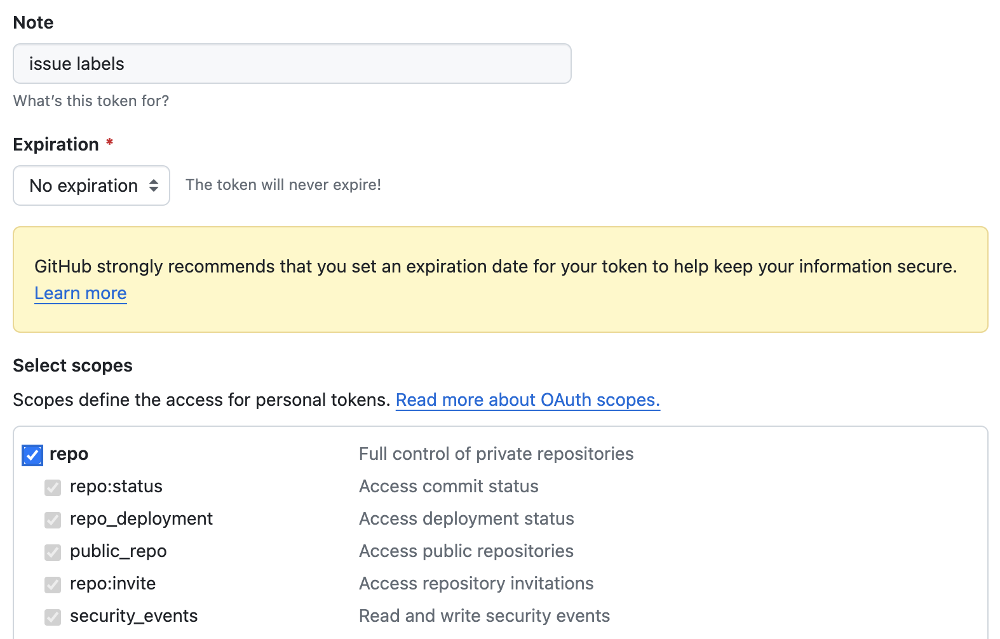
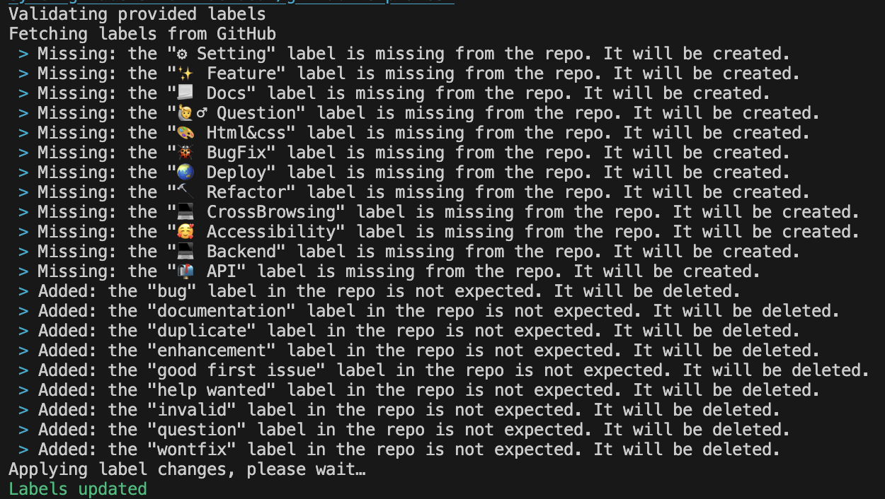

# Issues

## 이슈 라벨 커스텀해서 적용하기

### 1. github `Access-Token` 준비

- [settings/apps](https://github.com/settings/apps)에서 `Personal access tokens` - `generate new Token` 클릭
- `Select scopes`에서 repo 선택
  

### 2. 원하는 라벨 정보를 담은 json 파일 생성 (labels.json 파일 참조)

```json
[
  {
    "name": "⚙ Setting",
    "color": "e3dede",
    "description": "개발 환경 세팅"
  },
  {
    "name": "✨ Feature",
    "color": "fffade",
    "description": "기능 개발"
  }
]
```

### 3. 해당 파일(labels.json)이 저장된 위치에서 다음 명령어 입력

```bash
npx github-label-sync --access-token {access-token} --labels ./labels.json {repository}
```

- 작성 예시

```bash
npx github-label-sync --access-token ghp-MYTOKEN --labels ./labels.json devdeun/github-templates
```



### 적용된 모습

- [https://github.com/devdeun/github-templates/labels](https://github.com/devdeun/github-templates/labels)
